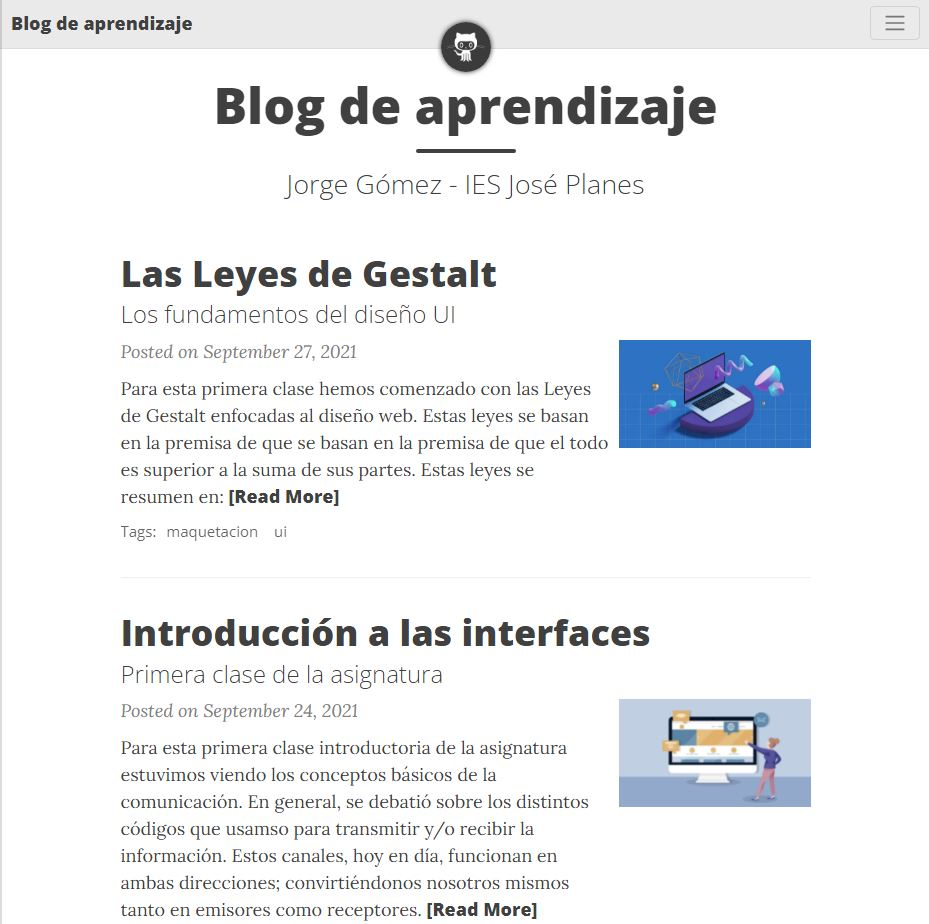

# Blog de aprendizaje

> Échale un ojo a la web &middot; [Demo](https://jorgegomezcarrillo.github.io/)

Blog personal para la asignatura *Diseño de Interfaces Web* impartido por la profesora *Susana Valverde* y desarrollado por Jorge Gómez, usando el generador de páginas estáticas [Jekyll](https://jekyllrb.com/).

